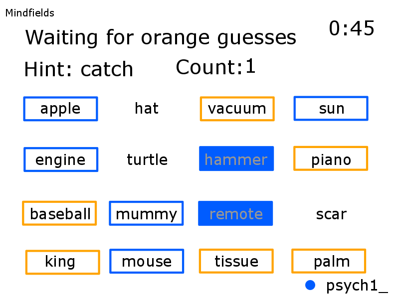

## Gameplay Mockup: Leader

### Welcome screen
The player is prompted to enter a screen name.  
The server keeps asking for one until the one entered is not in use already.

### Team selection
The player picks a team. Blue and orange are the only options for now.

### Role selection
The player picks a role: leader or member of the team.

### Board game display
The board game is shown to all players.  
A one-minute timer begins counting down to the first turn and the main game loop.

### Key words display
The team leader is prompted to provide a hint.  
A one-minute timer begins counting down to the guessing stage of the turn.

### Hint submission
The leader submits the hint for approval when ready.

### Hint approval
The leader of the opposing team approves or rejects the hint.  
If the hint is rejected, the leader gets another minute to submit a new hint.  
If the hint is accepted, the hint is shown to the team members to guess the associated words.

### Members guess words

The hint is shown to all players.  
A one-minute timer starts counting down.  
The team members pick the words they think are most closely associated with the hint, up to a maximum of the one set by the leader.

### First guess shown

The guesses are evaluated one by one, up to the maximum set by the team leader.  
The word is marked.  
If the guess is correct, the next word is evaluated.
If the guess is incorrect, the turn is over.

### Second guess shown

The word is marked.  
The number set by the team leader is reached, so the turn ends.

### Opposite team submits hint

The team leader of the opposite team is given a minute to submit a hint.

### Hint is approved or rejected

The hint is deemed appropriate, so it is accepted for the opposite team members to receive it.

### Opposite team members guess

The members of the opposite team are given a minute to submit their guesses.

### Oppsite team guesses are shown

The guesses submitted by the opposite team are evaluated and marked accordingly.

And so on, until all the keyed words of a given team are marked. The winning team is displayed then.